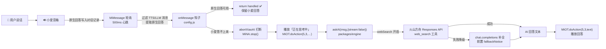

# MiGPT-Next 增强版

> 基于 [MiGPT-Next](https://github.com/idootop/migpt-next) 二次开发的本地增强版。官方版本已停止维护并移除了连续对话支持，本仓库在官方源码之上新增了 **防抢话、联网搜索、保留小爱原生回答、网络代理、非流式问答** 五项能力，并对小爱音箱 L05B 机型做了 TTS 兼容优化。

核心思路不变：**拦截小爱音箱的默认语音，把问题转发给任意兼容 OpenAI 接口的大模型（火山引擎豆包、DeepSeek 等），让小爱音箱「听你的」**。

## ⚠️ 项目状态

- 官方 [MiGPT-Next](https://github.com/idootop/migpt-next) 已停止维护，官方已移除对「连续对话」的支持。
- 本项目沿用官方单次问答定位：一次一问一答，不做多轮打断；同时保留流式基础设施，但**推荐在 `onMessage` 中使用非流式问答**（`{ stream: false }`，这也是联网搜索生效的前提）。
- 本项目所有描述以仓库代码为准，特性与源码路径一一对应。

## ✨ 特性总览

| # | 特性 | 说明 | 关键源码 |
|---|------|------|----------|
| 1 | 防抢话 + TTS 优化 | 引擎调 AI 前先播放「正在思考中」占位 500ms；`abortXiaoAI()` 真正调用 `MiNA.stop()` 打断小爱；轮询心跳降至 500ms；`#processing` 锁保证消息串行处理 | `packages/engine/src/index.ts`、`packages/next/src/speaker.ts`、`packages/next/src/index.ts` |
| 2 | 联网搜索 | 基于火山方舟 Responses API 内置 `web_search` 工具；`hybrid` 先本地判断是否需要搜索、`auto` 交给模型判断；失败自动降级普通模型并附提示语；播放前清洗链接与引用角标 | `packages/openai/src/web-search.ts`、`packages/openai/src/index.ts` |
| 3 | 保留小爱原生回答 | `extractNativeAnswer` 提取小爱已生成的回答（TTS / LLM），经 `metadata.xiaoAIAnswer` 透传给 `onMessage`；该字段**不会发送给大模型**，可决定「复用原生回答」还是「交给 AI 重答」 | `packages/next/src/native-answer.ts`、`packages/next/src/message.ts`、`packages/chat/src/index.ts` |
| 4 | 网络代理 | MiOT 请求自动读取 `HTTP_PROXY` / `HTTPS_PROXY` / `ALL_PROXY`（含小写）环境变量，Docker 部署 + 宿主机代理访问小米服务时很有用 | `packages/miot/src/utils/http.ts` |
| 5 | 非流式问答 | `askAI(msg, { stream: false })` 走一次性补全而非流式输出 | `packages/engine/src/base.ts`、`packages/engine/src/index.ts` |

## 🧠 工作原理



一句话总结处理链路：**小爱先答 → 答不上来才切换 LLM → LLM（可选联网）→ 播报**。默认引擎只处理 `callAIKeywords`（如「请」「你」）开头的消息；在 `config.js` 中可通过 `onMessage` 完全接管这一流程。

## 🚀 快速开始

### Docker 运行（推荐）

工程根目录提供了 `Dockerfile.local`，以官方镜像为基础，把本仓库 `miot / openai / engine / next` 四个包的编译产物覆盖进去：

```shell
# 1. 安装依赖并构建各包 dist 产物
pnpm install && pnpm build

# 2. 构建本地镜像
docker build -f Dockerfile.local -t migpt-next:local .

# 3. 修改根目录的 config.js 后挂载运行
docker run -it --rm -v $(pwd)/config.js:/app/config.js migpt-next:local
```

> 💡 本仓库**没有** `apps/example` 目录，配置文件就是工程根目录的 `config.js`（内含完整注释）。

### Node.js 运行

```shell
pnpm install @mi-gpt/next
```

```typescript
import { MiGPT } from "@mi-gpt/next";

async function main() {
  await MiGPT.start({
    speaker: { userId: "123456", password: "xxxxxxxx", did: "小爱音箱Play" },
    openai: {
      model: "gpt-4o-mini",
      baseURL: "https://api.openai.com/v1",
      apiKey: "sk-xxxxxxxxxxxx",
    },
    prompt: { system: "你是一个智能助手，请根据用户的问题给出回答。" },
  });
  process.exit(0);
}

main();
```

## ⚙️ 核心配置（config.js）

完整示例见工程根目录 [`config.js`](./config.js)，这里说明关键字段。

### speaker —— 小爱设备

```js
speaker: {
  did: "小爱音箱Play",          // 米家中设置的设备名称
  userId: "你的小米ID",         // 一串数字，非手机号/邮箱
  password: "你的密码",
  passToken: "可选，passToken 登录", // 获取教程见 FAQ
}
```

> 提示找不到设备时，打开 `debug: true` 可打印设备真实的 `name` / `miotDID` / `mac`。

### openai —— 大模型（兼容 OpenAI 接口）

```js
openai: {
  enableProxy: true,                                  // 是否走系统代理
  baseURL: "https://ark.cn-beijing.volces.com/api/v3", // 火山引擎示例，一般以 /v1 结尾
  apiKey: "你的 API Key",
  model: "ep-202608xxxxxxxxx",                        // 火山方舟接入点（ep 开头）
  extra: { requestOptions: { timeout: 60000 } },      // 请求超时（默认 30s）
}
```

### webSearch —— 联网搜索（特性 2）

```js
openai: {
  webSearch: {
    enabled: true,
    strategy: "hybrid", // hybrid=本地先判断；auto=每次都交给模型判断
    fallbackNotice: "联网搜索暂时不可用，以下内容可能不是最新。",
  },
}
```

- `hybrid` 下 `shouldUseWebSearch` 会命中：显式指令（"联网查/搜一下"）、时效词（今天/最新/今年…）、当前年份、易变信息（天气/新闻/股价/政策…）、时效角色（"XX 的 CEO 是谁"）。
- 命中后调用 Responses API + `web_search` 工具；失败自动降级普通补全，并在回答前拼接 `fallbackNotice`。
- 播放前 `sanitizeWebSearchText` 会移除 Markdown 链接、URL 和引用角标（如 `【1†】`），避免 TTS 念出链接。

### prompt / context / stream / callAIKeywords

```js
prompt: {
  system: "你是一个智能助手，请用简洁的语言回答用户的问题，每次回答控制在150字以内。",
},
context: { historyMaxLength: 10 }, // 携带的最大历史消息数（0 关闭）
stream: { maxReplyLength: 100 },   // 单次响应的最大长度（分句大小，L05B 建议 ≤100）
callAIKeywords: [""],              // 只回答以下关键词开头的消息
```

## 🧩 自定义 onMessage（核心扩展点）

`onMessage` 可以完全接管消息处理：先判断小爱原生回答是否可用，不可用再切换 LLM（完整示例见 `config.js`）：

```js
async onMessage(engine, msg) {
  // 1. 小爱已给出有效回答 → 保留原生回答，不打断
  if (xiaoAIAnswer && !isXiaoAIAnswerFailure(xiaoAIAnswer)) {
    return { handled: true };
  }
  // 2. 小爱答不上来 → 打断 + 占位 + 走 LLM（非流式，可联网）
  await engine.speaker.abortXiaoAI();
  await engine.MiOT.doAction(5, 3, "正在思考中");
  const { text } = await engine.askAI(msg, { stream: false });
  await engine.MiOT.doAction(5, 3, text);
  return { handled: true };
}
```

> ⚠️ `MiOT.doAction(5, 3, text)` 是 L05B 机型实测的「播放文本」动作（L05B 的 MiNA TTS 无法稳定抢占小爱原生回复）。其他机型 TTS 异常时，请换成你设备的 `ttsCommand`。

`onMessage` 可用的其他能力（完整示例见 [`packages/next/README.md`](packages/next/README.md)）：

- `engine.speaker.abortXiaoAI()` / `engine.speaker.play({ text | url })` —— 打断 / 播放
- `engine.MiNA` —— 设备控制（如 `setVolume`）
- `engine.MiOT` —— 万能指令（`doAction`）
- 返回值：`{ text }` / `{ url }` / `{ handled: true }` / `{ default: true }`

## 📁 源码结构

pnpm + turbo monorepo，共 7 个包：

| 包 | 职责 |
|---|---|
| `packages/miot` | 小米 MiNA / MIoT 服务 SDK（含 401 凭证自动刷新、代理支持）|
| `packages/openai` | OpenAI 兼容客户端 + 火山方舟 Responses 联网搜索 |
| `packages/engine` | 引擎基类：消息分发、默认 AI 响应链路（占位 / 打断 / 播放）|
| `packages/chat` | 对话管理：历史、提示词模板、流式/非流式调用 |
| `packages/next` | 小爱集成入口：轮询、设备控制、原生回答提取 |
| `packages/stream` | 流式分句（按标点切分、emoji 清洗）|
| `packages/utils` | 通用工具（`deepMerge`、`sleep` 等）|

## 🧪 本地开发与测试

```shell
pnpm install
pnpm build        # turbo run build，产出各包 dist
node --test tests # 运行 tests/ 下的 node:test 用例（依赖 dist 产物）
```

内置 5 个测试文件（`tests/`），覆盖：非流式问答、联网搜索判断与解析、原生回答提取、MiOT 代理透传、`config.js` 的 `onMessage` 行为。

## ❓ 常见问题

### Q1：一直提示登录失败？
大概率是小米账号触发安全验证。改用 `passToken` 登录，获取教程：https://github.com/idootop/migpt-next/issues/4

### Q2：小爱还是会抢话？
本项目已通过「占位 + `MiNA.stop()` 打断 + 500ms 快速轮询 + 串行锁」大幅缓解。若仍不满足，需刷机方案，参考 [Open-XiaoAI](https://github.com/idootop/open-xiaoai)。

### Q3：控制台有 AI 回复，但音箱播的是小爱自己的回答？
多为 TTS 兼容问题。请确认 `onMessage` 中用的是 `MiOT.doAction(5, 3, text)`（或你的设备 `ttsCommand`）播放，并已 `return { handled: true }` 阻止默认链路。

### Q4：如何把音箱变成智能家居 Agent？
在 `onMessage` 内根据 `text` 解析指令，请求本地 Home Assistant 的 Webhook 或红外设备 API 即可（参考「自定义 onMessage」）。

## 免责声明

1. **适用范围**：本项目为开源非营利项目，仅供学术研究或个人测试用途。严禁用于商业服务、网络攻击、数据窃取、系统破坏等违反《网络安全法》及使用者所在地司法管辖区法律的场景。
2. **非官方声明**：本项目由第三方开发者独立开发，与小米集团及其关联方无任何隶属/合作关系，未获官方授权/认可或技术支持。项目中涉及的商标、固件、云服务的所有权利归属小米集团。若权利方主张权益，使用者应立即主动停止使用并删除本项目。

继续下载或运行本项目，即表示您已完整阅读并同意 [用户协议](agreement.md)，否则请立即终止使用并彻底删除本项目。

## License

MIT License © 2024-PRESENT [Del Wang](https://del.wang)
